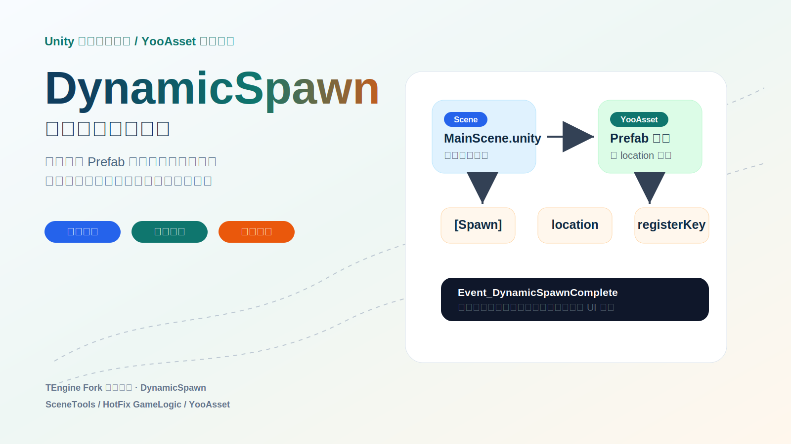
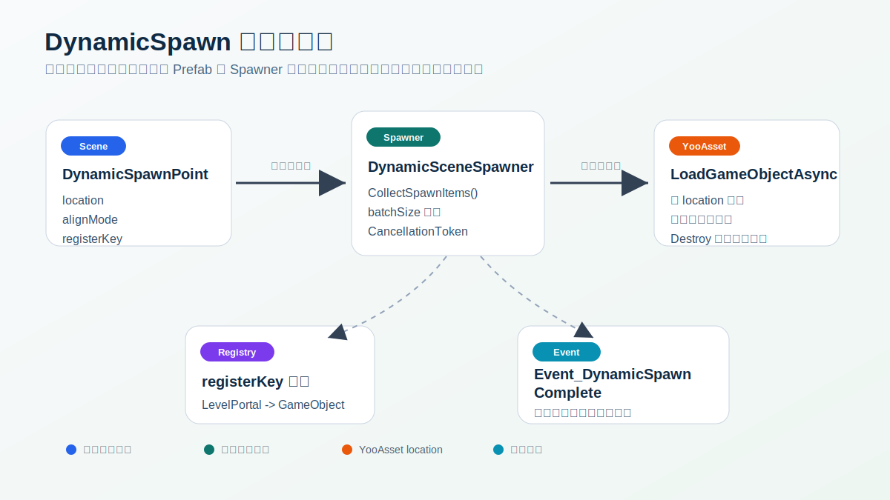
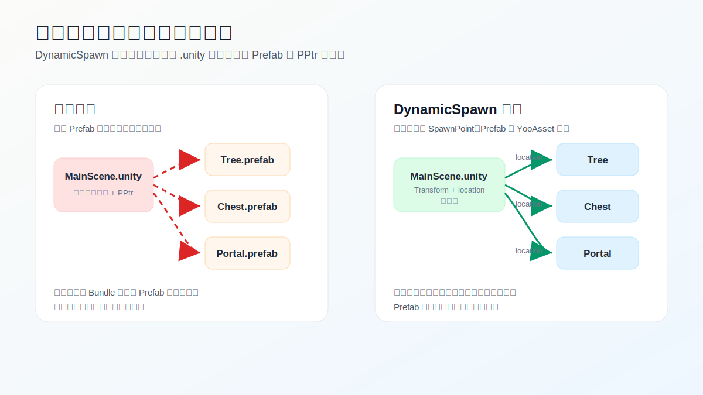
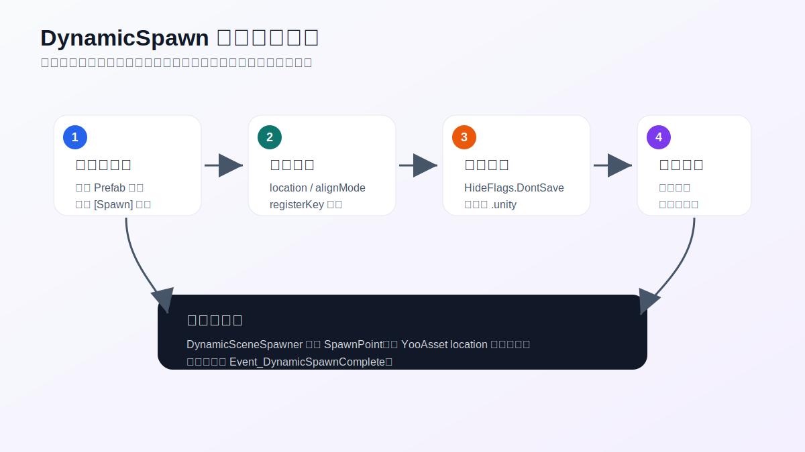

# 把 Unity 场景从 Prefab 硬引用里解放出来：DynamicSpawn 动态场景加载实践



> 本文基于项目中的 `DynamicSpawn` 实现编写，核心代码位于 `Assets/GameScripts/HotFix/GameLogic/Scenes/DynamicSpawn/`，编辑器工具位于 `Assets/Editor/SceneTools/DynamicSpawn/`。

在 Unity 项目里，场景经常会逐渐变成一个“巨型 Prefab 容器”：美术和关卡同学为了摆放方便，把大量装饰物、交互物、机关、UI 触发点、特效根节点直接拖进 `.unity` 场景文件。前期这很直观，打开场景就能看到全部内容；但项目进入资源分包、热更新、真机加载优化阶段后，这种做法会暴露出几个很现实的问题：

1. 场景文件越来越大，协作冲突也越来越频繁。
2. 场景对 Prefab 形成 PPtr 硬引用，AssetBundle 依赖关系被场景“粘”住。
3. 场景激活时对象一次性反序列化，加载峰值难控制。
4. 运行时逻辑很难判断“动态对象是否都已经就位”。
5. 编辑器里如果没有配套工具，改成纯代码加载又会牺牲摆放体验。

`DynamicSpawn` 解决的不是单一的“异步加载 Prefab”问题，而是把“场景摆放”“资源依赖”“运行时加载”“完成通知”“编辑器预览”这几件事重新拆开，让场景文件只保存轻量占位点，真正的 Prefab 在运行时按 YooAsset 的 `location` 动态加载。



## 一句话概括

`DynamicSpawn` 用 `DynamicSpawnPoint` 替代场景中的真实 Prefab 实例。每个占位点只保存 Transform、`location`、对齐模式和可选 `registerKey`。运行时由 `DynamicSceneSpawner` 收集这些占位点，分批调用 `GameModule.Resource.LoadGameObjectAsync` 加载真实对象，并在全部完成后发送 `Event_DynamicSpawnComplete`，让场景业务管理器安全地继续初始化。

它保留了编辑器里的“所见即所得”能力：工具可以临时放置预览实例，但这些预览对象带有 `HideFlags.DontSave`，不会写进场景文件，也不会重新制造场景到 Prefab 的打包依赖。

## 传统场景摆放的问题

最常见的做法是把 Prefab 实例直接拖进场景：

```text
MainScene.unity
├── Building_A.prefab instance
├── Tree_01.prefab instance
├── Chest.prefab instance
├── Portal.prefab instance
└── ...
```

这种结构的优点是直观，但代价也清楚：

- `.unity` 文件会序列化大量对象层级和组件数据。
- 场景文件会保存对 Prefab 资源的 PPtr 引用。
- 资源收集时，场景所在 Bundle 可能被迫依赖这些 Prefab 所在 Bundle。
- 进入场景时，Unity 会处理大量对象反序列化，难以按帧削峰。
- 如果后续想把某个对象改成热更资源，场景硬引用会成为阻力。

`DynamicSpawn` 的目标是让场景变成更轻的“布局描述”：

```text
MainScene.unity
├── [Spawn] Building_A  -> location = "Building_A"
├── [Spawn] Tree_01     -> location = "Tree_01"
├── [Spawn] Chest       -> location = "Chest", registerKey = "MainChest"
├── [Spawn] Portal      -> location = "Portal", registerKey = "LevelPortal"
└── ...
```

真实 Prefab 不再被场景直接引用，场景只告诉运行时：这个位置要加载哪个资源，以及加载出来后如何对齐。



## 核心结构

### DynamicSpawnPoint：场景里的轻量占位点

`DynamicSpawnPoint` 是挂在空 GameObject 上的组件，运行时字段很少：

- `location`：YooAsset 资源地址，通常是文件名，不含路径和扩展名。
- `alignMode`：加载出的实例如何对齐占位点。
- `registerKey`：可选的运行时查找键。

对应代码在：`Assets/GameScripts/HotFix/GameLogic/Scenes/DynamicSpawn/DynamicSpawnPoint.cs`

其中最关键的设计是：编辑器下可以有 Prefab 辅助引用，但它不是运行时对象引用，而是 GUID 字符串。

```csharp
#if UNITY_EDITOR
[HideInInspector]
[SerializeField]
private string prefabGuid;
#endif
```

这意味着制作人员仍然可以在 Inspector 中拖入 Prefab 辅助填写 `location` 和放置预览，但场景序列化数据里不会保留 `GameObject` PPtr 引用。旧版本如果已经保存过直接 Prefab 引用，也可以通过 `MigrateLegacyReferenceIfNeeded()` 迁移成 GUID 字符串并清空旧引用。

这是整个功能最重要的一点：它不是简单把 `Instantiate` 挪到运行时，而是主动避免场景和 Prefab 在打包依赖层面继续绑定。

### SpawnAlignMode：两种对齐策略

项目里提供了两个对齐模式：

- `AlignToPlaceholder`：实例作为占位点子物体，并把 localPosition、localRotation、localScale 归零，完全使用占位点的世界 TRS。
- `KeepPrefabLocal`：实例仍挂在占位点下，但保留 Prefab 根节点自带的 local TRS，适合 Prefab 根节点本身有偏移的情况。

这个选择看起来很小，但对场景制作很实用。不同团队的 Prefab 规范不一定完全统一，有些 Prefab 根节点就是模型中心，有些 Prefab 根节点可能带了逻辑偏移。把对齐策略显式放在占位点上，可以减少“为什么运行时位置偏了”的排查成本。

### DynamicSceneSpawner：收集、加载、削峰、通知

`DynamicSceneSpawner` 是运行时加载基类，对应代码在：`Assets/GameScripts/HotFix/GameLogic/Scenes/DynamicSpawn/DynamicSceneSpawner.cs`

它承担几件事：

1. 根据初始化模式决定何时开始加载。
2. 调用子类的 `CollectSpawnItems()` 收集加载项。
3. 使用 `GameModule.Resource.LoadGameObjectAsync(location, parent, token)` 加载对象。
4. 按 `batchSize` 分批 `await UniTask.Yield()`，避免一帧内加载过多。
5. 对齐实例到占位点。
6. 按 `registerKey` 注册实例。
7. 加载完成后发送 `Event_DynamicSpawnComplete`。

典型加载逻辑可以概括为：

```csharp
foreach (var item in items)
{
    var go = await GameModule.Resource.LoadGameObjectAsync(
        item.Location,
        parent: item.Parent,
        cancellationToken: token);

    AlignInstance(go, item);
    RegisterInstance(go, item);

    if (batchSize > 0 && reachedBatchLimit)
    {
        await UniTask.Yield(PlayerLoopTiming.Update, token);
    }
}

CompleteSpawn();
```

这里用的是 TEngine 项目推荐的 GameObject 加载方式。根据资源加载规范，`LoadGameObjectAsync` 会处理实例化和引用计数，场景卸载或对象销毁时不需要业务侧额外 `UnloadAsset`。

### SpawnPointSceneSpawner：默认实现

如果一个场景只需要从子节点里的 `DynamicSpawnPoint` 收集对象，直接挂 `SpawnPointSceneSpawner` 即可：

`Assets/GameScripts/HotFix/GameLogic/Scenes/DynamicSpawn/Load/SpawnPointSceneSpawner.cs`

它的实现非常薄：

```csharp
public class SpawnPointSceneSpawner : DynamicSceneSpawner
{
    protected override List<SpawnItem> CollectSpawnItems()
    {
        return CollectFromSpawnPoints();
    }
}
```

这也说明设计的扩展点很明确：默认用占位点，特殊场景可以继承 `DynamicSceneSpawner`，把占位点收集和代码列表收集混在一起。

## 初始化时机：把加载接到正确的场景阶段

`DynamicSceneSpawner` 支持多种启动模式：

- `Awake`：场景刚激活就开始，最早。
- `Start`：默认较稳妥，Awake 后一帧。
- `OnEnable`：每次激活都触发，但内部有防重复保护。
- `SceneReady`：收到 `Event_SceneReady` 后开始，适合 Loading UI 关闭后再加载。
- `Manual`：完全由外部调用 `SpawnAsync()`。

这比把加载写死在 `Start()` 里更灵活。不同场景可能有不同的体验诉求：

- 大场景可以在 Loading UI 仍然存在时开始加载，减少进入后的等待。
- 截图、剧情、引导场景可以等场景 ready 后再开始，避免镜头提前扫到半成品。
- 更严格的加载流程可以用 `Manual`，由场景管理器统一 `await SpawnAsync()`。

## 完成事件：让业务逻辑等对象真正就位

动态加载最大的坑之一是“逻辑先跑了，对象还没出来”。项目里通过 `Event_DynamicSpawnComplete` 解决这个问题：

`Assets/GameScripts/HotFix/GameLogic/Static/GlobalEventID.Scene.cs`

当 Spawner 加载完成后会发送：

```csharp
GameEvent.Send<SceneType>(
    GlobalEventID.Event_DynamicSpawnComplete,
    GameSceneManager.CurrentSceneType ?? SceneType.MainScene);
```

场景业务可以监听这个事件，再执行相机、UI、交互、引导等初始化逻辑。项目里还提供了 `SceneGameManagerBase<TSpawner>`：

`Assets/GameScripts/HotFix/GameLogic/SceneGameManager/SceneGameManagerBase.cs`

这个基类做了“双保险”：

1. 被动监听 `Event_DynamicSpawnComplete`。
2. 主动轮询 `spawner.IsSpawnCompleted`。

这样可以避免 Unity 生命周期顺序导致的漏事件。例如 Spawner 在 `Awake` 或 `Start` 里很快完成，而 Manager 稍晚才注册监听，主动轮询仍然能兜住。

子类只需要实现：

```csharp
protected override void OnSceneSpawnCompleted()
{
    // 动态对象全部就位后，再做场景业务初始化
}
```

## registerKey：从“加载完成”走向“可被业务找到”

并不是所有动态对象都需要被业务代码找回。纯装饰物加载出来就结束了。但交互点、镜头目标、出生点、传送门、宝箱等对象通常需要被后续逻辑引用。

`DynamicSpawnPoint.registerKey` 就是为这类对象准备的。加载完成后，`DynamicSceneSpawner` 会把有 key 的实例放入内部字典：

```csharp
private readonly Dictionary<string, GameObject> _registry;
```

业务侧可以通过 `GetSpawnedObject("PlayerSpawnRoot")` 拿到实例。这样就避免了满场景 `GameObject.Find()` 或把运行时对象引用重新序列化进场景。

需要注意的是，`registerKey` 应该只给真正需要被业务访问的对象配置。纯装饰物不要滥用 key，否则注册表会变成另一套难维护的隐式依赖表。

## 编辑器工具：不牺牲制作体验

如果只有运行时代码，DynamicSpawn 很容易变成“工程师喜欢，关卡同学讨厌”的方案。这个项目里的编辑器工具把制作体验补了回来。



### DynamicSpawnPoint Inspector

自定义 Inspector 提供：

- 运行时字段编辑：`location`、对齐模式、`registerKey`。
- Prefab 辅助引用：通过 GUID 字符串保存，不产生打包硬引用。
- 一键填充 `location` 和 `registerKey`。
- 一键对齐节点名为 `[Spawn] {location}`。
- 放置/移除预览实例。
- Prefab 缩略图预览。

预览实例会挂到占位点下，并设置 `HideFlags.DontSave`。也就是说，制作人员能在 Scene 视图里看到真实摆放效果，但保存场景时这些预览对象不会写入 `.unity` 文件。

### DynamicSceneSpawner Inspector

Spawner Inspector 支持批量放置和卸载预览。它会调用 `EditorCollectSpawnItems()`，按文件名查找 Prefab 并实例化临时预览。运行时还会显示：

- 是否加载完成。
- 注册表条目数。
- 每个 `DynamicSpawnPoint` 是否已经有运行时加载出的子物体。

这对调试非常直接：不需要翻日志就能知道当前场景是不是已经完成动态加载。

### DynamicSpawnPointManager 管理窗口

菜单路径：

```text
Tools/场景工具/动态加载点管理器
```

管理窗口提供更适合批量维护的能力：

- 总览当前场景所有 SpawnPoint。
- 按名称或 location 搜索。
- 仅显示异常项。
- 校验 `location` 是否能在工程 Prefab 中找到。
- 批量修复节点名。
- 批量放置和移除预览。
- 一键重连预览引用。
- 快速添加占位节点。
- 将选中的真实 Prefab 实例一键转换为占位节点。
- 迁移并清理旧 `prefabReference`，解开打包依赖。
- Scene 视图 Gizmo 标记：正常、异常、选中状态一眼可见。

特别是“一键转换”很实用：老场景可以先按传统方式摆好，然后选中已有 Prefab 实例，转换成 `[Spawn] xxx` 占位节点。工具会尽量保留原物体的世界位置、旋转和缩放，再删除原实例。

## 这个功能的真正优势

### 1. 场景文件变轻，协作更稳定

真实对象不再直接序列化进 `.unity`，场景主要保存占位节点的 Transform 和少量字符串字段。大场景里，成百上千个装饰物如果都改成占位点，场景文件体积和合并冲突都会明显下降。

### 2. 资源依赖更干净

场景不再通过 PPtr 硬引用 Prefab。打包时，场景 Bundle 不必被这些 Prefab 依赖牵着走。Prefab 可以作为 YooAsset 资源独立组织、独立更新、独立下载。

这对热更新尤其重要。否则你以为只改了一个小道具 Prefab，结果因为场景硬引用或 Bundle 依赖，更新包被场景资源拖大。

### 3. 加载峰值可控

`batchSize` 让动态对象加载可以按帧削峰。它不能让总工作量消失，但可以避免大量对象在同一帧里集中实例化，给低端机和复杂场景更多缓冲空间。

### 4. 业务初始化更可靠

`Event_DynamicSpawnComplete` 加上 `SceneGameManagerBase` 的轮询兜底，把“动态对象已经就位”变成明确状态。相机、交互、UI、引导逻辑不再需要猜测时机。

### 5. 制作流程仍然直观

预览实例、批量预览、Gizmo、异常筛选、快速转换，这些工具让 DynamicSpawn 不只是运行时方案，也是一个能落地给内容团队使用的工作流。

### 6. 兼容编辑器直接打开场景测试

正常启动时使用 YooAsset；编辑器里直接打开测试场景、资源系统未初始化时，Spawner 会通过编辑器辅助引用直接实例化 Prefab。这让开发者不用每次都从完整启动流程进场景，提高调试效率。

## 推荐使用流程

### 新场景

1. 在场景中创建一个 Spawner 根节点，挂上 `SpawnPointSceneSpawner`。
2. 打开 `Tools/场景工具/动态加载点管理器`。
3. 指定 Spawner 根节点和目标 Prefab。
4. 点击“添加占位节点”。
5. 在 Scene 视图里摆放 `[Spawn] xxx` 节点。
6. 需要被业务访问的对象填写 `registerKey`。
7. 批量放置预览，确认最终效果。
8. 移除预览，保存场景。

### 老场景迁移

1. 打开已有场景。
2. 选中需要动态化的 Prefab 实例。
3. 在管理窗口点击“将选中物体转换为占位节点”。
4. 检查 location 和对齐模式。
5. 批量放置预览，对比转换前后位置。
6. 点击“迁移并清理旧引用”，清理历史 PPtr 引用。
7. 保存场景并重新打包验证依赖。

### 业务侧等待动态对象

推荐让场景 Manager 继承 `SceneGameManagerBase<TSpawner>`：

```csharp
public class MainSceneManager : SceneGameManagerBase<SpawnPointSceneSpawner>
{
    protected override SceneType TargetSceneType => SceneType.MainScene;

    protected override void OnSceneSpawnCompleted()
    {
        GameObject portal = GetSpawnedObject("LevelPortal");
        // 相机、交互、UI、引导逻辑放在这里
    }
}
```

## 使用边界和注意事项

`DynamicSpawn` 很适合场景装饰物、交互点、可热更 Prefab、关卡机关、截图目标、镜头锚点等对象，但它不应该无脑替代所有场景对象。

建议直接留在场景里的对象：

- 场景生命周期核心对象，例如场景根管理器。
- 必须在 Awake 阶段立即存在的对象。
- 参与烘焙、导航、静态合批且必须由 Unity 场景直接管理的对象。
- 与场景文件强绑定、没有热更价值的小型结构。

需要额外规范的点：

- `location` 依赖资源命名，重名 Prefab 需要约定相对路径或唯一命名。
- `registerKey` 要保持唯一，重复 key 当前会覆盖旧实例并打警告。
- 批量加载不是免费优化，Prefab 自身的 Awake/OnEnable 成本仍然存在。
- 预览实例只是编辑器辅助，不要把业务逻辑绑在 `[Preview]` 子物体上。
- 老场景迁移后要保存场景，PPtr 才会真正从磁盘上的 `.unity` 文件中消失。

## 可以继续演进的方向

当前实现已经覆盖了从制作到运行的主链路，后续可以考虑几个增强：

- 在构建前增加自动校验，扫描空 `location`、不存在的 Prefab、重复 `registerKey`。
- 记录每个 SpawnItem 的加载耗时，输出场景级动态加载报告。
- 支持按标签、距离、优先级分阶段加载。
- 在管理窗口里显示 YooAsset `CheckLocationValid` 结果，而不仅是工程 Prefab 文件名缓存。
- 对超大场景接入区域触发或流式加载，不必一次性收集全部占位点。

## 总结

`DynamicSpawn` 的价值不只是“让对象晚一点加载”。它把 Unity 场景从 Prefab 硬引用中拆出来，让场景文件变成轻量布局，让资源依赖回到 YooAsset 的 location 体系，让加载过程可以分批、取消、等待、通知，也让编辑器制作仍然保持可视化。

对一个正在做热更新和资源分包的 Unity 项目来说，这类机制往往比单点性能优化更重要。它改变的是生产方式：场景负责描述“哪里要有什么”，资源系统负责决定“什么时候加载出来”，业务逻辑只在“对象真正就位”之后继续执行。
