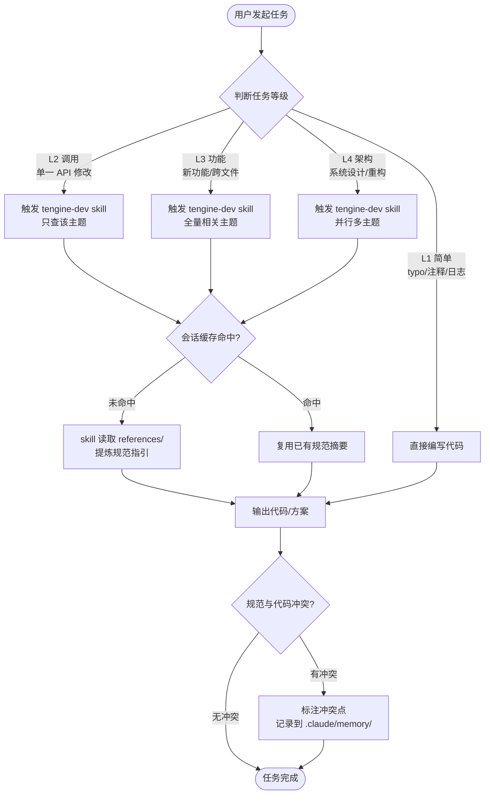
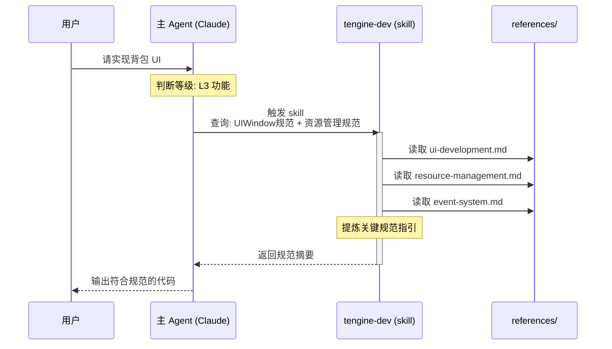
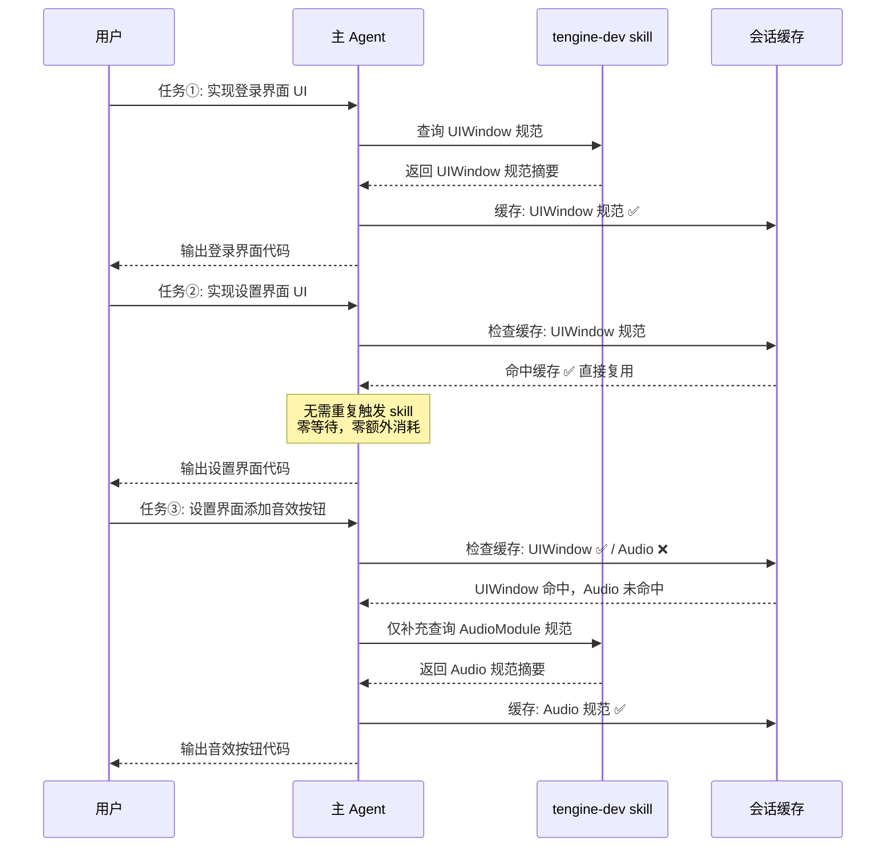
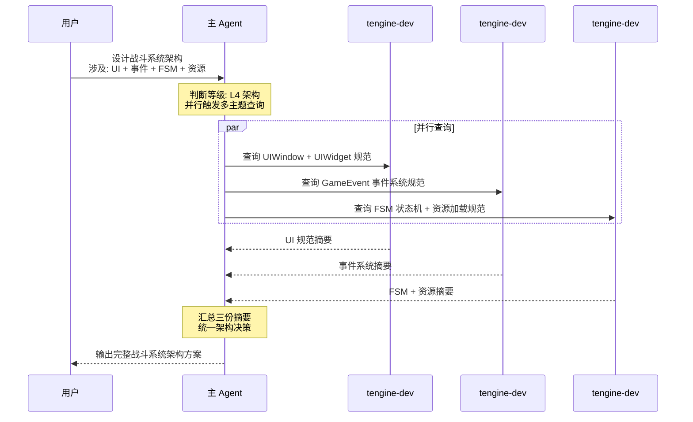
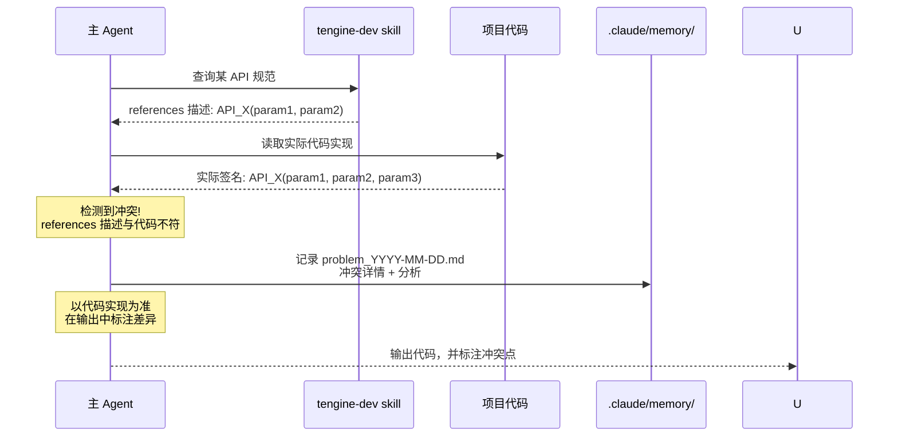

# TEngine

<div align="center">


**Unity 框架解决方案**

[](https://unity3d.com/)
[](LICENSE)
[](https://github.com/ALEXTANGXIAO/TEngine)
[](https://github.com/ALEXTANGXIAO/TEngine/issues)
[](https://github.com/ALEXTANGXIAO/TEngine)
[](https://deepwiki.com/Alex-Rachel/TEngine)

</div>

---

## 🛠️ 本 Fork 的定制改动

> 本仓库 fork 自上游 [ALEXTANGXIAO/TEngine](https://github.com/ALEXTANGXIAO/TEngine)，在其基础上做了一系列围绕**热更新、资源打包、运行时配置、场景加载**的定制改造。以下为相对上游新增/修改的能力清单（按主题归类，最新在前）。

### 🧾 日志系统

- **TouchSocket 日志桥接** — 新增 `TouchSocketContainerUnityDebugLogger`、`UnityLoggerBridge` 与 `AddUnityDebugLogger` 扩展：TouchSocket.Core 日志可进入 Unity Console，Unity/Task/UniTask 日志与未观察异常通过 TouchSocket `FileLogger` 落盘，并带重入保护、过期日志清理与 Editor Console 跳转过滤。
- **Editor 打开日志目录菜单** — `OpenFolderHelper` 新增 `TEngine/Open Folder/Log Files Path`，一键打开 `persistentDataPath/Logs` 落盘目录（目录未生成时回退到 Persistent Data Path）。
- **日志查看工具 LogViewer** — 仓库根 `Tools/LogViewer/` 下新增 Go + Wails 桌面工具，编译为单体 exe：打开/拖入 `.log` 即可查看，支持级别筛选、关键词检索高亮、自动剥离富文本标签、堆栈折叠，兼容编辑器与打包后两种堆栈格式。

### 📡 事件系统

- **按事件类型批量取消监听（`GameEvent.RemoveAllListeners`）** — 在 `GameEvent`/`EventDispatcher`/`EventDelegateData` 三层新增，无需持有注册时的委托，凭事件 ID（手写 `const` 或接口事件生成的 `IXxx_Event.OnXxx`）即可清空该事件下的全部监听，且不影响其他事件；支持 int / string 两种事件 ID。复用底层既有的延迟增删机制，回调过程中调用也安全。补足原框架"取消必须传回注册委托、无法从别处取消"的短板。

### 🔧 运行时配置

- **TOML 序列化扩展（`Utility.Toml`）** — 集成 `Tomlyn.2.9.0` 并在 `TEngine.Runtime` 增加 TOML 门面与默认 `TomlynTomlHelper`，支持对象与 TOML 文本互转（`ToToml` / `ToObject<T>` / `ToObject(Type, ...)`），可通过 `ITomlHelper` 替换实现；适合轻量配置、工具配置或更注重可读性的结构化文本。
- **轻量 JSON 配置模块（`JsonConfigModule`）** — 在 `TEngine.Runtime` 内新增，从 `StreamingAssets/Configs` 按 `config_manifest.json` 清单加载并缓存 JSON 配置，支持强类型 `Get/TryGet`、原始文本读取与对象缓存；通过 `GameModule.JsonConfig` 访问。保留原 Luban `ConfigSystem` 不动。JSON 序列化默认切换为 Newtonsoft。
- **部署配置覆盖热更地址（`DeployConfig`）** — 打包后可通过明文 `StreamingAssets/Configs/DeployConfig.json` 现场覆盖 `UpdateSetting` 的资源服务器地址；`ProcedureLaunch` 在资源初始化前加载，读不到时回退 Inspector 默认值。
- **部署配置控制调试器开关（`DeployConfig.DebuggerActiveWindow`）** — `DeployConfig` 新增 `DebuggerActiveWindow` 字段，打包后可经明文 JSON 现场覆盖 `Debugger` 组件的激活策略（`AlwaysOpen` / `OnlyOpenWhenDevelopment` / `OnlyOpenInEditor` / `AlwaysClose`）。`Debugger` 抽出 `ApplyActiveWindowType`，`ProcedureLaunch` 在配置加载完成后解析并应用；字段留空、解析失败或场景无 Debugger 时回退 Inspector 默认行为。

### 🔄 热更新

- **多包架构** — 将热更 DLL 从默认资源包中拆出为独立 `CodePackage`，编辑器打包工具与运行时配置共用同一份资源包数据源。
- **代码包 XXTEA 加密** — 仅对代码包加密，不全局加密所有资源包。
- **版本确认与下载流程** — 恢复“有本地版本可取消、无本地版本强制更新”的可选更新提示流程。
- **AOT 元数据热更清单** — 将 AOT 元数据列表从基础包序列化引用中解耦，支持后续热更补充。
- **AOT 元数据打包期校验** — 打 AB 包时单向校验 `AOTMetadataManifest.asset` 必须包含 `AOTGenericReferences.PatchedAOTAssemblyList` 的全部程序集，缺失即中断构建（避免运行时 `ExecutionEngineException`）；允许 manifest 含手动补充的额外项（仅告警）。拷贝 AOT DLL 时源文件不存在改为报错中断而非静默跳过。新增 `HybridCLR/Build/Sync AOT Metadata Manifest` 菜单与打包工具窗口「同步 AOT 元数据清单」「编译并拷贝热更DLL」按钮，同步时保留手动添加项。
- **PlayerPrefs 版本记录清理工具** — 项目内菜单/窗口，快速清理“上次成功更新版本号”，方便反复测试热更。

### 📦 资源打包

- **按包构建管线** — 资源包不再统一单一管线，支持按包指定 YooAsset 构建管线（保留 SBP / RawFile，移除 BBP）。
- **发布整理流程** — 构建后自动整理产物到发布目录，统一运行时平台目录名与 YooAsset 构建目录名，避免 404。
- **打包工具构建流程预览** — 打包工具窗口新增「构建流程预览」面板，按实际执行顺序（编译热更DLL → 构建AB → 发布整理 → 最小包处理 → 构建Player）动态展示步骤，启用步骤递增编号、未启用步骤灰显跳过，并随配置实时刷新，解决 UI 折叠区域顺序与执行顺序错位导致的困惑。
- **打包工具 Odin 化与卡顿优化** — `BuildPipelineWindow` 迁移为 `OdinEditorWindow`，用 `BoxGroup` / `TableList` / `ValueDropdown` 等 Odin 特性声明式组织资源包、发布整理、热更 DLL、Player 与构建日志；资源包编辑改为延迟落盘，状态栏/发布预览走缓存，日志刷新节流，避免编辑时频繁 `AssetDatabase.SaveAssets()` 与 `Repaint()`。

### 🎬 场景系统

- **DynamicSpawn 通用化与示例脚本** — 将仅调用 `CollectFromSpawnPoints()` 的机库专属 `HangarSceneSpawner` 收敛为通用 `SpawnPointSceneSpawner`，大多数场景可直接挂载；同时把 `HangarManager` 改为 `ExampleSceneGameManager` 示例，演示动态加载完成后如何按 `registerKey` 获取对象并执行场景初始化。详见 [DynamicSpawn 动态场景加载实践](Books/DynamicSpawn-动态场景加载实践.md)。
- **场景加载进度拆分到 `GameSceneModule`** — 将原“胖 UI” `LoadingUI` 的三段式进度状态机、场景资源加载（suspendLoad）、激活（UnSuspend）、完成回调与关闭时机全部下沉到 `GameSceneModule`（实现 `IUpdateModule`，由 `ModuleSystem` 每帧驱动），`SwitchUI` 降为纯展示（每帧读 `GameModule.GameScene.DisplayProgress` 渲染进度条与百分比）。激活改为模块直连 `UnSuspend`（不再 UI 自发事件→模块自收），终结顺序 `回调→关加载页→OnSceneReady` 以对齐 `DynamicSceneSpawner` 的“加载页关闭后才收 OnSceneReady”契约；删除 `LoadSceneDataBody` 数据载体。

### 🖥️ 窗口管理

- **窗口布局控制模块（`ScreenModule`）** — 在 `TEngine.Runtime`（AOT 层）新增，Windows Standalone 下控制 Unity 多屏窗口的位置/大小/强制置顶/无边框；原生 P/Invoke 在 IL2CPP 下编译、不进 HybridCLR 解释域。配置可选（缺失时回退主显示器分辨率并告警），应用前自动切窗口化避免全屏覆盖，非 Windows 平台调用仅告警不执行。通过 `GameModule.Screen` 访问。

> 📄 各项改动的详细设计、使用方式与排查过程见 [Fork 定制改动说明](Books/Fork-定制改动说明.md)，更细的过程记录见 `UnityProject/conversation-summaries/` 下对应日期的会话总结。

---

## 📖 简介

**TEngine** 是一个简单（新手友好、开箱即用）且强大的 Unity 框架全平台解决方案。对于需要一套上手快、文档清晰、高性能且可拓展性极强的商业级解决方案的开发者或团队来说，TEngine 是一个很好的选择。

### ✨ 核心特性

- 🚀 **开箱即用** - 5 分钟即可上手整套开发流程，代码整洁，思路清晰
- 🔥 **高性能** - 基于 UniTask 的异步系统，零 GC 事件分发，严格的内存管理
- 🧩 **高内聚低耦合** - 模块化设计，可轻松移除或替换不需要的模块
- 🔄 **热更新支持** - 集成 HybridCLR，全平台热更新流程已跑通
- 📦 **资源管理** - 集成 YooAsset，支持 LRU、ARC 缓存策略，自动资源释放
- 📊 **配置表系统** - 集成 Luban，支持懒加载、异步加载、同步加载
- 🎨 **UI 框架** - 商业化 UI 开发流程，支持代码自动生成
- 🌍 **全平台支持** - Windows、Android、iOS、WebGL、微信小游戏等

---

## 📚 目录

- [本 Fork 的定制改动](#️-本-fork-的定制改动)
- [快速开始](#-快速开始)
- [AI 开发工作流](#-ai-开发工作流)
- [文档导航](#-文档导航)
- [核心模块](#-核心模块)
- [项目结构](#-项目结构)
- [系统要求](#-系统要求)
- [服务器支持](#-服务器支持)
- [开源项目推荐](#-开源项目推荐)
- [Demo 项目](#-demo-项目)
- [贡献与支持](#-贡献与支持)

---

## 🚀 快速开始

### 环境要求

- **Unity 版本**: 2021.3.20f1c1（推荐）或更高
- **支持版本**: Unity 2019.4 / 2020.3 / 2021.3 / 2022.3
- **Odin Inspector**: 仓库不内置该插件，请自行从 Odin 官方渠道下载并导入项目后再打开工程
- **开发环境**: .NET 4.x
- **支持平台**: Windows、OSX、Android、iOS、WebGL

### 快速上手

1. **克隆项目**
   ```bash
   git clone https://github.com/ALEXTANGXIAO/TEngine.git
   ```

2. **打开项目**
   - 使用 Unity 2021.3.20f1c1 打开项目

3. **编辑器模式运行**
   - 选择顶部栏目 `EditorMode` 编辑器下的模拟模式
   - 点击 `Launcher` 开始运行

4. **打包运行**（热更新流程）
   - 运行菜单 `HybridCLR/Install...` 安装 HybridCLR
   - 运行菜单 `HybridCLR/Define Symbols/Enable HybridCLR` 开启热更新
   - 运行菜单 `HybridCLR/Generate/All` 进行必要的生成操作
   - 运行菜单 `HybridCLR/Build/BuildAssets And CopyTo AssemblyPath` 生成热更新 DLL
   - 运行菜单 `YooAsset/AssetBundle Builder` 构建 AB
   - 打开 Build Settings，点击 Build And Run

> 💡 **提示**: 遇到问题请查看 [HybridCLR 常见错误](https://hybridclr.doc.code-philosophy.com/docs/help/commonerrors)

详细教程请参考：[快速开始指南](Books/1-快速开始.md)

---

## 🤖 AI 开发工作流

TEngine 深度集成了一套面向 Claude Code 的 AI 辅助开发工作流。通过 **tengine-dev skill 按需查询架构**、**任务等级分级触发**和**会话内缓存机制**，实现了规范驱动、高效的 AI 开发体验。

---

### 核心工具

| 工具 | 用途 |
|------|------|
| **tengine-dev** | Claude Code 专用 TEngine 开发技能，从 `references/` 提供全模块规范 |
| **Unity-MCP** | Unity Editor 自动化操作（场景、资源、脚本） |
| **openspec** | 规范驱动的变更管理 |
| **wiki-synchelper** | Wiki 文档同步助手（手动触发时使用） |

---

### 整体工作流总览



---

### 时序图一：规范获取流程

> **核心优势**：tengine-dev skill 直接从精炼的 `references/` 文档提取规范，无多余上下文噪声。



---

### 时序图二：会话内缓存机制

> **核心优势**：同一会话中相同主题只查询一次，后续任务直接复用，避免重复消耗。



---

### 时序图三：并行多主题查询（L4 架构任务）

> **核心优势**：架构级任务并行查询多个主题，汇总后统一决策，大幅减少串行等待。



---

### 时序图四：规范冲突处理

> **核心优势**：AI 主动检测 references 与代码的不一致，标注冲突并记录，以代码实现为最终依据。



---

### 工作流快速参考

```
┌─────────────────────────────────────────────────────────┐
│                   TEngine AI 工作流                      │
├─────────────────────────────────────────────────────────┤
│  Step 0  判断任务等级 L1/L2/L3/L4                        │
│  Step 1  L1 直接编码                                     │
│         L2-L4 触发 tengine-dev skill 获取规范            │
│         （会话内缓存命中则直接复用，无需重复触发）        │
│  Step 2  基于规范输出代码/方案                            │
│  Step 3  若规范与代码冲突，标注冲突，记录到 .claude/memory/│
└─────────────────────────────────────────────────────────┘
```

详细规范请参考：[CLAUDE.md](UnityProject/CLAUDE.md) | [AI 开发工作流指南](Books/AI-Development-Workflow.md)

---

## 📚 文档导航

### 基础文档

| 文档 | 描述 |
|------|------|
| [📖 介绍](Books/0-介绍.md) | TEngine 框架介绍与核心特性 |
| [🏗️ 框架概览](Books/2-框架概览.md) | 框架架构与设计理念 |
| [🚀 快速开始](Books/1-快速开始.md) | 5 分钟快速上手教程 |
| [🌍 全平台运行](Books/99-各平台运行RunAble.md) | 各平台运行截图展示 |
| [🤖 AI 开发工作流](Books/AI-Development-Workflow.md) | openspec + tengine-dev AI 开发指南 |

### 核心模块文档

| 模块 | 文档 | 描述 |
|------|------|------|
| 📦 **资源模块** | [3-1-资源模块](Books/3-1-资源模块.md) | YooAsset 资源管理，支持 LRU/ARC 缓存 |
| 🎯 **事件模块** | [3-2-事件模块](Books/3-2-事件模块.md) | 零 GC 事件系统，支持 MVE 架构 |
| 💾 **内存池模块** | [3-3-内存池模块](Books/3-3-内存池模块.md) | 轻量级内存池管理 |
| 🎮 **对象池模块** | [3-4-对象池模块](Books/3-4-对象池模块.md) | 游戏对象池管理 |
| 🎨 **UI 模块** | [3-5-UI模块](Books/3-5-UI模块.md) | 商业化 UI 框架，支持代码生成 |
| 📊 **配置表模块** | [3-6-配置表模块](Books/3-6-配置表模块.md) | Luban 配置表系统 |
| 🔄 **流程模块** | [3-7-流程模块](Books/3-7-流程模块.md) | 商业化启动流程 |
| 🌐 **网络模块** | [3-8-网络模块](Books/3-8-网络模块.md) | 网络通信模块 |

---

## 🧩 核心模块

### 资源模块 (ResourceModule)

- ✅ 基于 YooAsset 的资源管理系统
- ✅ 支持 EditorSimulateMode、OfflinePlayMode、HostPlayMode
- ✅ AssetReference 资源引用标识，自动管理资源生命周期
- ✅ AssetGroup 资源组管理
- ✅ LRU/ARC 缓存策略
- ✅ 同步/异步加载支持

### 事件模块 (GameEvent)

- ✅ 零 GC 事件系统
- ✅ 支持 string/int 事件 ID
- ✅ 支持 MVE（Model-View-Event）架构
- ✅ UI 生命周期自动绑定事件清理

### UI 模块 (UIModule)

- ✅ 纯 C# 实现，脱离 Mono 生命周期
- ✅ 代码自动生成工具
- ✅ UIWindow/UIWidget 分层设计
- ✅ 支持全屏面板管理
- ✅ 事件驱动架构

### 配置表模块 (ConfigSystem)

- ✅ 集成 Luban 配置表解决方案
- ✅ 支持懒加载、异步加载、同步加载
- ✅ 强大的数据校验能力
- ✅ 完善的本地化支持

### 流程模块 (ProcedureModule)

完整的商业化启动流程：
- ProcedureLaunch → ProcedureSplash → ProcedureInitPackage
- ProcedurePreload → ProcedureInitResources
- ProcedureUpdateVersion → ProcedureUpdateManifest
- ProcedureCreateDownloader → ProcedureDownloadFile
- ProcedureDownloadOver → ProcedureClearCache
- ProcedureLoadAssembly → ProcedureStartGame

---

## 📁 项目结构

```
Assets/
├── AssetArt/              # 美术资源目录
│   └── Atlas/            # 自动生成图集目录
├── AssetRaw/             # 热更资源目录
│   ├── UIRaw/            # UI 图片目录
│   │   ├── Atlas/        # 需要自动生成图集的 UI 素材目录
│   │   └── Raw/          # 不需要自动生成图集的 UI 素材目录
│   ├── Audios/           # 音频资源
│   ├── Effects/          # 特效资源
│   └── Scenes/           # 场景资源
├── Editor/               # 编辑器脚本目录
├── HybridCLRData/        # HybridCLR 相关目录
├── Scenes/               # 主场景目录
├── TEngine/              # 框架核心目录
│   ├── Editor/           # TEngine 编辑器核心代码
│   ├── Runtime/          # TEngine 运行时核心代码
│   └── AssetSetting/     # YooAsset 资源设置
└── GameScripts/          # 程序集目录
    ├── Main/             # 主程序程序集（启动器与流程）
    └── HotFix/           # 游戏热更程序集目录
        ├── GameBase/     # 游戏基础框架程序集 [Dll]
        ├── GameProto/    # 游戏配置协议程序集 [Dll]
        └── GameLogic/    # 游戏业务逻辑程序集 [Dll]
            ├── GameApp.cs                  # 热更主入口
            └── GameApp_RegisterSystem.cs   # 热更主入口注册系统
```

---

## 💻 系统要求

### Unity 版本

- **推荐版本**: Unity 2021.3.20f1c1
- **支持版本**: Unity 2019.4 / 2020.3 / 2021.3 / 2022.3

### 平台支持

- ✅ Windows (Standalone)
- ✅ macOS (Standalone)
- ✅ Android
- ✅ iOS
- ✅ WebGL
- ✅ 微信小游戏

### 开发环境

- .NET 4.x
- Visual Studio 2019+ 或 Rider

---

## 🌐 服务器支持

TEngine 本身为**纯净的客户端框架**，不强绑定任何服务器。但针对个人开发以及中小型公司开发双端，我们推荐使用 **C# 服务器**。

### 为什么选择 .NET Core？

.NET Core 8.0 在性能和设计上具有显著优势：
- ⚡ **高性能** - AOT、JIT 混合编译
- 🔧 **组件化结构** - 模块化设计
- 🔥 **热重载** - 提升开发效率
- 📈 **性能测试** - 除 C++ 外，性能表现优异

### 服务器框架推荐

- **[GameNetty](https://github.com/ALEXTANGXIAO/GameNetty)** - 源于 ETServer，首次拆分最新的 ET8.1 的前后端解决方案（包），客户端最精简约 750k，几乎零成本无侵入嵌入
- **[Fantasy](https://github.com/qq362946/Fantasy)** - 源于 ETServer 但极为简洁，更好上手的商业级服务器框架（Fantasy 分支已集成）

---

## 🌟 开源项目推荐

| 项目 | 描述 | 链接 |
|------|------|------|
| **YooAsset** | 商业级经历百万 DAU 游戏验证的资源管理系统 | [GitHub](https://github.com/tuyoogame/YooAsset) |
| **HybridCLR** | 特性完整、零成本、高性能、低内存的近乎完美的 Unity 全平台原生 C# 热更方案 | [GitHub](https://github.com/focus-creative-games/hybridclr) |
| **Luban** | 最佳游戏配置解决方案 | [GitHub](https://github.com/focus-creative-games/luban) |
| **Fantasy** | 源于 ETServer 但极为简洁，更好上手的商业级服务器框架 | [GitHub](https://github.com/qq362946/Fantasy) |
| **GameNetty** | 源于 ETServer，首次拆分最新的 ET8.1 的前后端解决方案 | [GitHub](https://github.com/ALEXTANGXIAO/GameNetty) |
| **JEngine** | 使 Unity 开发的游戏支持热更新的解决方案 | [GitHub](https://github.com/JasonXuDeveloper/JEngine) |
| **DGame** | 根据TEngine框架，结合工作经验，修改和增加一些实用性拓展修改的框架 | [GitHub](https://github.com/AmaniDawn/DGame) |
| **AlicizaXTemplate** | AlicizaX 是一套面向 Unity 项目的框架模板 | [GitHub](https://github.com/AlicizaX/AlicizaXTemplate) |


### 社区 Demo

- **[TowerDefense-TEngine-Demo](https://github.com/daydayasobi/TowerDefense-TEngine-Demo)** - 群友大佬的塔防 Demo

---

## 🎮 Demo 项目

最新的 Demo 飞机大战位于 **demo 分支**，欢迎体验！

```bash
git checkout demo
```

---

## 💡 为什么要使用 TEngine？

### 1. 开箱即用
- ✅ 5 分钟即可上手整套开发流程
- ✅ 代码整洁，思路清晰，功能强大
- ✅ 高内聚低耦合，可轻松移除或替换不需要的模块

### 2. 商业级解决方案
- ✅ 严格按照商业要求使用次世代的 **HybridCLR** 进行热更新
- ✅ 最佳的 **Luban** 配置表（支持懒加载、异步加载、同步加载）
- ✅ 百万 DAU 游戏验证过的 **YooAsset** 资源框架
- ✅ 全平台热更新流程已跑通

### 3. 严格的内存管理
- ✅ YooAsset 资源自动释放
- ✅ 支持 LRU、ARC 严格管理资源内存
- ✅ 防止内存泄漏

### 4. 商业化流程
- ✅ 商业化的热更新流程
- ✅ 商业化的 UI 开发流程
- ✅ 商业化的资源管理

### 5. 全平台验证
- ✅ 已有项目使用 TEngine 上架 **Steam**
- ✅ 已有项目使用 TEngine 上架 **微信小游戏**
- ✅ 已有项目使用 TEngine 上架 **App Store**

---

## 🤝 贡献与支持

## 🙏 感谢所有为 TEngine 做出贡献的开发者

[](https://github.com/Alex-Rachel/TEngine/graphs/contributors)

### 贡献

欢迎提交 Issue 和 Pull Request！

### 支持项目

如果 TEngine 对您有帮助，欢迎支持项目发展：

[☕ 请我喝杯奶茶](Books/Donate.md)

您的赞助会让我们做得更快更好！如果觉得 TEngine 对您有帮助，不妨请我可爱的女儿买杯奶茶吧~ 🥤

---

<div align="center">

**Made with ❤️ by TEngine Team**

[⭐ Star](https://github.com/ALEXTANGXIAO/TEngine) | [🐛 Issues](https://github.com/ALEXTANGXIAO/TEngine/issues) | [📖 Wiki](https://deepwiki.com/Alex-Rachel/TEngine)

</div>
