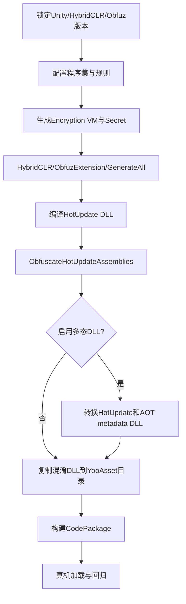

# HybridCLR集成

## 为什么需要Obfuz4HybridCLR

普通 Obfuz 能独立混淆 DLL，但 HybridCLR 还有特殊流程：

- HybridCLR 和 Obfuz 都可能携带/使用 dnlib，存在程序集冲突；
- 热更新 DLL 在 Player Build 之外单独编译；
- AOT 程序集改名会影响 link.xml 和裁剪；
- 补充元数据 DLL 也可能需要多态结构；
- GenerateAll 会生成/修改 HybridCLR native 代码；
- 热更新、DHE 和 AOT 元数据有不同输出目录。

Obfuz4HybridCLR 将这些步骤封装成兼容命令。官方明确建议 HybridCLR 项目使用扩展包，不要自行复制普通独立混淆示例拼装生产流程。

## 官方集成解决的问题

### dnlib冲突

同时安装两个包时，若包含不同 dnlib 副本，可能出现类型重复、版本不匹配或编辑器编译错误。扩展包提供兼容依赖组织，应按其安装说明使用匹配版本。

### AOT裁剪与link.xml

被混淆 AOT 类型名称变化后，原始 link.xml 失效。Obfuz 和扩展包需要在 UnityLinker 前生成使用混淆名的 link.xml。

### 热更新DLL混淆

HybridCLR 的 CompileDll 输出原始 DLL，扩展命令负责：

- 找到正确 BuildTarget 输出；
- 用相同程序集配置和 VM 混淆；
- 输出到专用目录；
- 对需要混淆/只需复制的程序集分别处理；
- 可选转换为多态 DLL。

## 推荐命令替换

官方手册要求使用：

```text
HybridCLR/ObfuzExtension/GenerateAll
```

替代原始：

```text
HybridCLR/Generate/All
```

并使用扩展的 Compile/Obfuscate 流程替代单纯 `HybridCLR/CompileDll/...`。原因是 GenerateAll 还可能注入多态 DLL native 支持和生成与混淆后 AOT 名称匹配的数据。

## 标准工作流



## AOT与热更新的密钥选择

- AOT 混淆代码通常使用静态 Scope，启动时初始化。
- 热更新程序集可使用动态 Scope，在加载业务代码前初始化。
- Encryption VM 若在 AOT，则同主包热更新不能修改 VM secret/opcode count。
- 动态密钥可以按热更新版本轮换。

如果 `GameLogic` 的静态构造器在动态密钥加载前执行，其常量/字段解密会失败。动态 Scope 初始化必须早于任何相关 `Assembly.GetTypes`、入口反射或静态字段访问。

## TEngine当前实现

[BuildDLLCommand.cs](file://Assets/TEngine/Editor/HybridCLR/BuildDLLCommand.cs) 在 `ENABLE_HYBRIDCLR && ENABLE_OBFUZ` 下：

1. 编译 DLL；
2. 获取 `PrebuildCommandExt.GetObfuscatedHotUpdateAssemblyOutputPath(target)`；
3. 调用 `ObfuscateUtil.ObfuscateHotUpdateAssemblies`；
4. 读取待混淆程序集名；
5. 对列表内 DLL 从混淆目录复制，其他 DLL 从原始目录复制；
6. 输出为 `*.dll.bytes` 供 YooAsset CodePackage 收集。

已有保护：

- `GameLogic`、`GameProto` 在 Obfuz 配置中；
- `GameApp` 入口名保留；
- UI 派生类型名保留；
- `ENABLE_OBFUZ` 与 release 模式关联；
- dev PDB 与 release 清理流程已存在。

## 当前未验证项

- Obfuz/Obfuz4HybridCLR 未在 `Packages/manifest.json` 显式锁定；
- `Assets/Obfuz` 和密钥资源不存在；
- 未看到 EncryptionService 初始化；
- mapping 不存在；
- 未验证扩展 `GenerateAll` 已执行；
- `PolymorphicDllSettings.enable=1`，但 native 支持和输出未证明；
- Build Pipeline 自动混淆关闭；
- 所有 Pass 开启且无规则，风险过高；
- 混淆分支重复编译与 PDB 行为需要验证。

## 运行时加载

TEngine 的 [ProcedureLoadAssembly.cs](file://Assets/GameScripts/Procedure/ProcedureLoadAssembly.cs) 从 YooAsset 加载 TextAsset，再调用 `Assembly.Load`。普通混淆 DLL 仍是标准 PE/CLI 文件，可直接加载；多态 DLL 需要对应 HybridCLR native 支持。

加载顺序建议：

```text
初始化静态Encryption Scope
  -> 加载/初始化动态Secret
  -> 加载AOT补充元数据
  -> 加载热更新DLL
  -> 注册TypeMapper/XLua映射
  -> 反射GameApp.Entrance
```

若补充元数据 DLL 也使用多态结构，`RuntimeApi.LoadMetadataForAOTAssembly` 必须接收已转换的 bytes。

## PDB与调试

本工程 dev 模式通过 `Assembly.Load(dllBytes, pdbBytes)` 加载 PDB。需要明确：

- PDB 必须与最终加载的 DLL 匹配；
- 对原始 DLL 生成的 PDB 未必能正确映射混淆后 IL；
- Release 构建应移除 PDB；
- 线上排障依赖 mapping，而不是把 PDB 随包发布；
- 如需混淆后调试，评估 Obfuz 是否保留/重写 PDB，并以实际版本为准。

## 验收清单

1. 扩展 GenerateAll 成功且无 dnlib 冲突。
2. 混淆 DLL 可由 ILSpy 打开并确认符号/Pass 生效。
3. 真机 HybridCLR 加载成功。
4. AOT metadata 补充成功。
5. GameApp 入口可反射调用。
6. UI 地址、序列化、配置和事件正常。
7. 同主包旧/新热更新均可按策略加载。
8. mapping 能还原真机异常堆栈。
9. release 包不含 PDB、默认 secret 和 debug mapping。
10. 多态 DLL 若启用，标准 DLL 禁载策略与回滚方案通过测试。

## 官方来源

- [与HybridCLR协同工作](https://github.com/focus-creative-games/obfuz-doc/blob/main/docs/manual/hybridclr/work-with-hybridclr.md)
- [Obfuz+HybridCLR入门](https://github.com/focus-creative-games/obfuz-doc/blob/main/docs/beginner/work-with-hybridclr.md)
- [Obfuz4HybridCLR仓库](https://github.com/focus-creative-games/obfuz4hybridclr)

