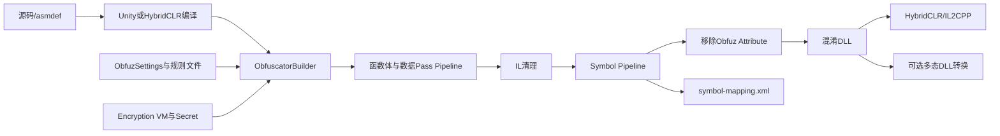

# Obfuz架构与混淆管线

> **当前 Fork 提示**：多态热更 DLL 已接入显式产物转换，程序集包使用 Archive 管线时由 `RawFileObject` 提供字节。当前实现见 [HybridCLR集成](HybridCLR集成.md) 和 [当前 Fork 定制功能](../../项目概述/当前Fork定制功能.md)。

## 总体架构

Obfuz 在编辑器阶段加载托管程序集，通过 dnlib 修改程序集元数据和 IL，再写出新的 DLL。运行时的 `Obfuz.Runtime` 提供解密、类型映射等基础设施；HybridCLR 扩展负责把混淆结果接入热更新 DLL、AOT 裁剪和多态 DLL 生成流程。



## 核心对象

### ObfuzSettings

Unity 项目级配置，默认序列化在 `ProjectSettings/Obfuz.asset`。它聚合：

- 构建回调设置；
- 程序集分类与搜索路径；
- 全局 Pass 开关和规则文件；
- Secret 与 Encryption VM；
- 各具体 Pass 设置；
- 垃圾代码、水印和多态 DLL 设置。

### ObfuscatorBuilder

Builder 将配置转为可运行的 `Obfuscator`：

- 创建程序集解析器和搜索路径；
- 计算待重写程序集集合；
- 构造 PassPolicy、RenamePolicy 和加密 Scope；
- 根据 `enabledPasses` 注册实际 Pass；
- 设置输入、输出、mapping 和运行模式。

在 `3.1.0` 源码中，默认 Builder 注册顺序可概括为：

```text
ReflectionCompatibilityDetection（按需）
ConstEncrypt
RemoveConstField
ExprObfus
EvalStackObfus（源码注册被注释）
FieldEncrypt
CallObfus
ControlFlowObfus
Watermark
SymbolObfus
```

### Obfuscator

`Obfuscator.Run()` 驱动完整转换。源码把符号混淆与前面的代码重写分开处理：函数体 Pass 先修改代码和引用，再执行清理和符号改名。这样可以让前置 Pass 使用稳定的原始元数据进行分析，同时在最后统一更新引用和 mapping。

### PassPolicy

PassPolicy 决定某个 assembly/type/method/field/property/event 最终启用哪些 Pass。最终结果不是简单读取一个开关，而是由以下层次共同决定：

```text
全局 Enabled Passes
  ∩ Pass规则文件结果
  ∩ 内置安全策略
  ∩ [ObfuzIgnore]等Attribute约束
  ∩ 具体Pass的专用规则/白名单
```

### RenamePolicy

RenamePolicy 决定某个元数据是否允许改名。Obfuz 内置 .NET 与 Unity 策略，并允许通过 `Custom Rename Policy Types` 追加自定义策略。符号规则允许改名，不代表最终一定改名；内置兼容策略仍可能将目标排除。

## 为什么符号混淆放在后面

假设代码先改名，再做调用或字段重写，后续 Pass 必须在大量新名称和跨程序集引用中工作，出错面更大。Obfuz 采用“先结构重写、后符号改名”的方式：

1. 前置 Pass 根据原始签名分析目标。
2. 生成辅助类型、RVA 数据、dispatch、delegate 或解密调用。
3. 清理无效 IL 和临时结构。
4. 对最终元数据统一改名。
5. 更新所有被混淆程序集及第 4 类引用程序集中的引用。
6. 输出 mapping，供下次增量和堆栈还原使用。

## 输入与输出

### 构建流程模式

在 Player Build 中，`Obfuz.Unity.ObfuscationProcess` 通过 Unity 的 `IPostBuildPlayerScriptDLLs` 回调修改编译后的托管程序集。原始和混淆程序集会分别保存到类似目录：

```text
Library/Obfuz/<BuildTarget>/OriginalAssemblies
Library/Obfuz/<BuildTarget>/ObfuscatedAssemblies
```

### 独立混淆模式

开发者也可以自行编译 DLL，然后使用 `ObfuscatorBuilder.FromObfuzSettings(...)` 构建并运行混淆器。这适合热更新 DLL，但使用 HybridCLR 时应优先使用 Obfuz4HybridCLR 已封装的流程。

### 长期产物

| 产物 | 用途 | 是否应版本化 |
|---|---|---|
| `GeneratedEncryptionVirtualMachine.cs` | 运行时加解密实现 | 是；按主包版本管理 |
| 静态密钥资源 | AOT/早期初始化使用 | 不应以明文默认值公开；需安全分发策略 |
| 动态密钥资源 | 热更新 Scope 使用 | 可按热更新版本轮换 |
| `symbol-mapping.xml` | 稳定改名、堆栈还原 | 必须版本管理并按发布版本归档 |
| debug mapping | Debug 符号还原 | 建议归档，不随正式包分发 |
| 混淆 DLL | Player 或热更新加载 | 发布制品 |
| 多态 DLL | HybridCLR 自定义结构 DLL | 与主包结构密钥强绑定 |

## 内置清理与保护

Obfuz 生成的辅助类型和方法一般带 `$Obfuz$` 特征。函数体策略会避免再次混淆这些生成代码以及 Encryption VM 自身，防止递归重写。最后的 `RemoveObfuzAttributesPass` 会从混淆程序集移除 `[ObfuzIgnore]`、`[EncryptField]` 等 Obfuz Attribute，避免直接暴露保护意图。

## 安全边界

Obfuz 的强度来自多层组合：

- 符号不可读；
- 常量不以明文存储；
- 字段内存值被编码；
- 调用关系被 dispatch/delegate 间接化；
- 控制流被平坦化；
- Encryption VM 每个项目不同；
- HybridCLR DLL 和 metadata 结构可随机化。

攻击者若能控制进程，仍可能在解密后观察数据、hook 运行时方法或追踪最终调用。因此关键数值和权限判定仍必须由服务端掌握。

## 本工程对应关系

本工程使用 [BuildDLLCommand.cs](file://Assets/TEngine/Editor/HybridCLR/BuildDLLCommand.cs) 调用 Obfuz4HybridCLR：

```text
CompileDll
  -> CopyAOT/HotUpdate DLL
  -> ENABLE_OBFUZ 条件下重新编译
  -> ObfuscateHotUpdateAssemblies
  -> 从混淆或原始目录选择 DLL
  -> 复制为 YooAsset TextAsset
```

需要注意：存在调用链不等于所有生成条件已经满足。当前 `Assets/Obfuz`、密钥资源和 mapping 文件均不存在，必须先完成生成和初始化，再验证真机产物。

## 官方来源

- [Obfuscation Pass](https://github.com/focus-creative-games/obfuz-doc/blob/main/docs/manual/obfuscation-pass.md)
- [构建过程中执行混淆](https://github.com/focus-creative-games/obfuz-doc/blob/main/docs/manual/build-pipeline.md)
- [单独执行混淆](https://github.com/focus-creative-games/obfuz-doc/blob/main/docs/manual/run-obfuscation-standalonely.md)
- [Obfuz 源码：ObfuscatorBuilder](https://github.com/focus-creative-games/obfuz/blob/main/Editor/ObfuscatorBuilder.cs)
